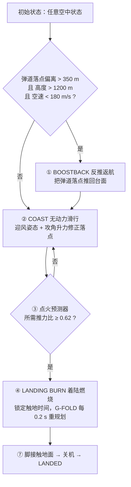

# Vector Thrust：火箭定点回收的凸优化制导与控制

> ## 🚀 在线模拟：[http://64.83.43.106:8080/](http://64.83.43.106:8080/)
>
> 浏览器直接打开，无需安装。仿真（Python 刚体物理 + 凸优化制导）通过 Pyodide/WebAssembly 在**你自己的浏览器里**运行，服务器只发送静态文件。
> 建议用桌面版 Chrome / Edge（需要 WebGL2）；首次加载要下载约 20 MB（gzip 后）的 Python 运行时，请稍候。
>
> **⚠️ 仅供演示学习。** 这是教学用的仿真与算法演示：飞行器参数是示意值（不是任何真实火箭的数据），物理与气动模型做了大幅简化，没有导航误差、传感器噪声和故障处理，**不得用于真实飞行器的设计、安全评估或任何工程决策**。这不是 SpaceX 的官方项目，与 SpaceX 无关联；“SpaceX”“Falcon 9”是其各自所有者的商标，此处仅用来描述被模仿的着陆方式。

**摘要。** 本项目在一台“类 Falcon 9 一级”的 6 自由度模型上，完整实现了自动定点回收：从**任意空中状态**开启自动模式后，火箭经 **反推返航 → 无动力滑行 → 最优时刻点火 → 一次连续的着陆燃烧**，直接烧到触地并落在发射台中心。制导核心是凸优化动力下降规划（Açıkmeşe–Ploen 无损凸化，即 G-FOLD 结构），用二阶锥规划（SOCP）由 Clarabel 求解器求解；内环是“规划推力前馈 + PD 修正 + SO(3) 几何姿态控制 + 栅格舵/万向节/冷气推进器力矩分配”。本文档按**阶段**说明用了什么控制方法、公式、定理、算法，以及对应的代码函数，方便学生边读边改边跑。

## 目录

- [1. 你能从这个项目学到什么](#1-你能从这个项目学到什么)
- [2. 问题建模：要解决什么](#2-问题建模要解决什么)
- [3. 方法总览](#3-方法总览)
- [4. 被控对象：物理与气动模型](#4-被控对象物理与气动模型)
- [5. 各阶段的控制方法](#5-各阶段的控制方法)
  - [5.1 反推返航（BOOSTBACK）](#51-反推返航boostback)
  - [5.2 无动力滑行（COAST）](#52-无动力滑行coast)
  - [5.3 点火时机](#53-点火时机)
  - [5.4 着陆燃烧：G-FOLD 凸优化（核心）](#54-着陆燃烧g-fold-凸优化核心)
  - [5.5 轨迹跟踪内环](#55-轨迹跟踪内环)
  - [5.6 姿态控制与执行机构分配](#56-姿态控制与执行机构分配)
  - [5.7 触地与成败判定](#57-触地与成败判定)
- [6. 求解器：Clarabel](#6-求解器clarabel)
- [7. 2D 版与 3D 版的差别](#7-2d-版与-3d-版的差别)
- [8. 实验与结果](#8-实验与结果)
- [9. 可视化：流体、仪表与交互](#9-可视化流体仪表与交互)
- [10. 安装与运行](#10-安装与运行)
- [11. 代码地图与阅读顺序](#11-代码地图与阅读顺序)
- [12. 课题与练习](#12-课题与练习)
- [13. 局限（请务必读）](#13-局限请务必读)
- [14. 参考文献](#14-参考文献)

## 1. 你能从这个项目学到什么

| 主题 | 对应章节 | 需要的基础 |
| --- | --- | --- |
| 最优控制与“为什么先自由落体再猛烧”（bang-bang / hover-slam） | §5.3、§5.4.6 | 微积分、质点动力学 |
| 凸优化建模：SOCP、无损凸化、精确罚函数 | §5.4 | 线性代数、凸优化入门 |
| 离散化：一阶保持（FOH）的精确离散 | §5.4.4 | 常微分方程 |
| 滚动时域（MPC 式）重规划与“锁定终端时间” | §5.4.8 | 控制理论入门 |
| 轨迹跟踪：前馈 + 反馈 | §5.5 | PD 控制 |
| 刚体姿态控制：四元数、SO(3) 误差、力矩分配 | §5.6 | 刚体力学、线性代数 |
| 大气、气动力、栅格舵模型 | §4 | 流体力学入门 |
| 数值仿真与验收测试 | §8、§10 | Python / numpy |

## 2. 问题建模：要解决什么

**任务。** 一级火箭分离后处于任意位置、速度、姿态（高度可以是 100 m，也可以是 12 km，速度可能带着朝外飞的水平分量）。要求它自己回到发射台，以近乎竖直、接近 1 m/s 的下沉速度、几乎零水平速度、落点误差 ≪ 台面半径的状态触地，同时燃料够用。

记位置 $\mathbf r=(x,y,h)$（东、北、天，$h$ 为高度，原点在台面中心）、速度 $\mathbf v$、质量 $m$、推力矢量 $\mathbf T$、重力加速度矢量 $\mathbf g=(0,0,-g_0)$、气动加速度 $\mathbf d$。这个问题可以写成一个**最优控制问题**（记为 P0）：

$$
\begin{aligned}
\min_{t_f,\ \mathbf T(\cdot)}\quad & \int_0^{t_f}\lVert\mathbf T(t)\rVert\,dt \;=\; I_{sp}\,g_0\,\bigl(m_0-m(t_f)\bigr) && \text{（耗油最少）}\\
\text{s.t.}\quad & \dot{\mathbf r}=\mathbf v,\quad \dot{\mathbf v}=\mathbf T/m+\mathbf g+\mathbf d,\quad \dot m=-\alpha\lVert\mathbf T\rVert,\ \ \alpha=\tfrac{1}{I_{sp}g_0}\\
& T_{\min}\le\lVert\mathbf T\rVert\le T_{\max} && \text{（发动机不能关到 0，也有上限）}\\
& \lVert\mathbf T\rVert\cos\theta_{\max}\le T_z && \text{（推力倾角限制）}\\
& \sqrt{x^2+y^2}\le h\tan\gamma && \text{（滑翔锥：别贴地横飞）}\\
& m\ge m_{dry}\\
& \mathbf r(t_f)=\mathbf 0,\quad \mathbf v(t_f)=(0,0,-v_{td}) && \text{（落在台面中心、竖直、轻触地）}
\end{aligned}
$$

**为什么难？** P0 是非凸的：

1. 推力下限 $\lVert\mathbf T\rVert\ge T_{\min}$ 挖掉了一个“空心”，可行集不凸；
2. 质量随推力消耗变化，加速度 $\mathbf T/m$ 是控制量与状态之比，动力学不是线性的；
3. 终端时间 $t_f$ 是未知的；
4. 气动加速度 $\mathbf d$ 依赖状态和箭体姿态。

本项目的思路是：**用变量替换 + 无损凸化把 1、2 变成凸问题；对 3 做一维搜索；对 4 沿上一条规划轨迹逐次线性化**——见 §5.4。

## 3. 方法总览

### 3.1 阶段流程（3D 自动驾驶，`guidance3d.py: Autopilot3D`）



图中的 ⑤ 轨迹跟踪与 ⑥ 姿态/执行机构控制是贯穿 ①–④ 的内环，不是独立阶段。

**没有单独的“末端下降/悬停阶段”**：着陆燃烧的规划终点就是台面（竖直、约 1.2 m/s 下沉），发动机一直工作到着陆腿触地才关闭，关机后不再点火。

### 3.2 每个阶段用了什么方法（速查表）

| 阶段 | 目标 | 控制/制导方法 | 关键公式或算法 | 代码入口 |
| --- | --- | --- | --- | --- |
| ① 反推返航 BOOSTBACK | 把无动力落点从远处推回台面附近 | 落点预测–校正（预测落点反馈）+ 比例节流；姿态用 SO(3) 控制，冷气 RCS 提供力矩 | $\Delta\mathbf v_h=-\mathbf r_{imp}/t_{fall}$（§5.1） | `Autopilot3D._pre_ignition`、`_ballistic` |
| ② 无动力滑行 COAST | 发动机关闭，稳定迎风；用箭体升力微调落点 | 数值弹道预测 + 攻角气动导引；栅格舵做姿态执行器 | $\mathbf a_{des}=-\mathbf r_{imp}/[t_{ign}(t_{imp}-t_{ign}/2)]$，$\alpha=a_{des}\,m/(\partial F/\partial\alpha)$（§5.2） | `_aero_steer`、`_ballistic` |
| ③ 点火判定 | 找“最晚仍来得及”的点火时刻（hover-slam） | 解析点火预测器：竖直匀减速 + 横向最小能量（ZEM/ZEV）加速度 | $f=m\lVert\mathbf a_{need}\rVert/T_{avail}\ge 0.62$（§5.3） | `_burn_need`、`_pre_ignition` |
| ④ 着陆燃烧 LANDING BURN | 一次连续燃烧、直接烧到触地，燃料尽量省，推力平滑 | **G-FOLD 凸优化**：SOCP + 无损凸化 + FOH 离散 + L1 精确罚；滚动时域 5 Hz 重规划；锁定触地时间，不可达时只前移到“最早可达”时刻 | §5.4 的全部公式 | `Planner3D.build/solve`、`Autopilot3D._replan/_earliest` |
| ⑤ 轨迹跟踪（内环） | 让实际轨迹贴住规划轨迹 | 规划推力前馈 + 位置/速度 PD 修正 + 倾角/下沉包络限幅 + 推力方向转速限制 | $\mathbf a_{cmd}=\mathbf u_{ff}+K_p\Delta\mathbf r+K_v\Delta\mathbf v$（§5.5） | `Autopilot3D.command`、`_fly_accel` |
| ⑥ 姿态与执行机构 | 把箭体轴对准指令方向 | SO(3) 几何误差 + 级联角速度环 + 制动距离限速 + 栅格舵→TVC→RCS 力矩分配 | $\mathbf e_R=\tfrac12(R_d^\top R-R^\top R_d)^\vee$、最小二乘分配（§5.6） | `attitude_control`、`fin_effectiveness` |
| ⑦ 触地 | 判定成败 | 弹簧–阻尼接触模型；脚接触即关机 | $F_n=\max(0,k\delta-c\dot\delta)$（§5.7） | `Vehicle._contact/_check_landed` |

2D 版（`main.py` + `guidance.py`）用**同一个凸规划思想**，但把“反推返航—滑行—点火”全部交给“自由终端时间的燃料最优搜索”自然产生（§7），是更适合入门的最小版本。

### 3.3 多速率结构

| 层 | 频率 | 做什么 |
| --- | --- | --- |
| 弹道预测（滑行段） | 每 0.25 s（反推时每 0.1 s） | 积分无动力弹道，得到预测落点、点火时刻 |
| 凸优化重规划（着陆燃烧） | 5 Hz（每 0.2 s） | 求解一个 SOCP，得到从“现在”到触地的整条轨迹与推力剖面 |
| 轨迹跟踪 + 姿态控制 | 与物理同步：3D 为 240 Hz，2D 为 120 Hz | 前馈 + 反馈，输出节流、万向节、栅格舵、RCS |
| 执行机构 | 每个物理步 | 节流速率 1.2 /s；万向节 ±8°、30°/s；栅格舵 ±20°、40°/s（3D 参数） |
| 刚体物理 | 240 Hz（3D）/ 120 Hz（2D） | 半隐式欧拉积分 |

## 4. 被控对象：物理与气动模型

代码：`rocket3d.py`（刚体、发动机、大气、风、接触）、`aero3d.py`（气动力与栅格舵）。

### 4.1 6 自由度刚体

世界系为本地东-北-天（ENU），体系 $+z_b$ 沿箭体轴（发动机 → 箭头）。位置、速度在世界系，姿态用单位四元数 $\mathbf q$（$R(\mathbf q)$ 把体轴向量转到世界系）：

$$
m\dot{\mathbf v}=R(\mathbf q)\,\mathbf T_b+m\,\mathbf g(h)+\mathbf F_{aero}+\mathbf F_{contact},\qquad \dot{\mathbf r}=\mathbf v
$$

$$
I\dot{\boldsymbol\omega}=\boldsymbol\tau-\boldsymbol\omega\times(I\boldsymbol\omega),\qquad \dot{\mathbf q}=\tfrac12\,\mathbf q\otimes(0,\boldsymbol\omega),\qquad \boldsymbol\tau=\boldsymbol\tau_{TVC}+\boldsymbol\tau_{RCS}+\boldsymbol\tau_{aero}+\boldsymbol\tau_{contact}
$$

$$
g(h)=g_0\Bigl(\frac{R_E}{R_E+h}\Bigr)^2
$$

积分器是**半隐式欧拉**（先更新速度再用新速度更新位置；四元数积分后归一化），步长 1/240 s。

### 4.2 推进剂、质量、质心、转动惯量

两个贮箱（LOX 8630 kg、RP-1 3370 kg，混合比约 2.56）按推力对应的质量流量同比例消耗。质量、质心、转动惯量随剩余推进剂变化：

$$
m=m_d+m_f,\qquad z_c=\frac{m_d z_d+m_f z_f}{m_d+m_f},\qquad z_f=z_{tank,bot}+\tfrac12 h_{fill}
$$

干重按均匀细杆（系数 0.85）、推进剂按液柱，再用平行轴定理移到质心（`Vehicle.mass_properties`）。

发动机推力与比冲随环境压力 $p$ 变化：

$$
\dot m=\eta\,\dot m_{max},\qquad T=\dot m\,I_{sp}(p)\,g_0,\qquad I_{sp}(p)=I_{sp,vac}-(I_{sp,vac}-I_{sp,sl})\min\!\Bigl(1,\frac{p}{101325}\Bigr)
$$

$\eta\in[0,1]$ 是节流。因为质量流量由油门决定，**同样的油门下，箭越轻加速度越大**——这正是规划器把质量取对数 $z=\ln m$ 作状态的原因（§5.4）。

| 参数（示意值） | 数值 |
| --- | --- |
| 干质量 / 推进剂 | 8000 kg / 12000 kg（满载推重比约 1.84） |
| 海平面推力 | 360 kN |
| $I_{sp}$（海平面 / 真空） | 282 s / 311 s |
| 尺寸 | 长 18 m，直径 3 m |
| 最小节流（规划器设定） | 20 % |
| 万向节（TVC） | ±8°，30°/s |
| 栅格舵 | 4 片，±20°，40°/s，展开/收起 1.5 s |
| 冷气 RCS 力矩 | 俯仰/偏航 60 kN·m，滚转 22 kN·m |
| 着陆腿 | 4 条，弹簧–阻尼，展开 2 s |

> 这些数是为了让仿真好看、好算而设的**示意参数**，不是 Falcon 9 的真实数据。

### 4.3 大气与风

国际标准大气（ISA，`atmosphere`）：对流层 $T=288.15-0.0065h$，$p=101325\,(T/288.15)^{5.25588}$，$\rho=p/(287.05\,T)$，声速 $a=\sqrt{1.4\cdot 287.05\,T}$；11 km 以上等温层按指数衰减，25 km 以上升温。

风（`Wind`）：对数风廓线加阵风。默认 10 m 高度 6 m/s、阵风 1.8 m/s：

$$
u(z)=u_{10}\,\frac{\ln(z/z_0)}{\ln(10/z_0)},\quad z_0=0.05\ \text{m}
$$

### 4.4 气动力（工程模型，`aero3d.AeroModel`）

动压 $q=\tfrac12\rho\lVert\mathbf v_{rel}\rVert^2$，马赫数 $M=\lVert\mathbf v_{rel}\rVert/a$，$\mathbf v_{rel}=\mathbf v-\mathbf w$（风速 $\mathbf w$）。设箭体轴与来流的夹角为攻角 $\alpha$（相对迎风端），参考面积 $A_{ref}=\pi D^2/4$，侧面积 $A_{plan}=LD$。

- **轴向力**：$\mathbf F_A=-\mathrm{sgn}(c)\,q A_{ref}C_A\,\hat{\mathbf z}_b$，其中 $c=\hat{\mathbf u}\cdot\hat{\mathbf z}_b$（$c>0$ 箭头朝前，$c<0$ 发动机朝前），$C_A=C_{A0}(M)\cos^2\alpha$，两种朝向的 $C_{A0}$ 不同。
- **法向力** = 位势项 + 粘性横流项：

$$
C_N=\underbrace{\frac{\sin\alpha\cos\alpha}{\sqrt{1-\min(M,0.85)^2}}}_{\text{细长体位势流 + Prandtl–Glauert 修正}}+\underbrace{0.62\,C_{d,c}(M)\,\frac{A_{plan}}{A_{ref}}\sin^2\alpha}_{\text{Jorgensen 横流（圆柱绕流）项}}
$$

- **跨声速阻力上升**：用 smoothstep 在 $0.8\le M\le1.1$ 内从 $C_{low}$ 升到 $C_{peak}$，$M>1.1$ 后按 $e^{-(M-1.1)/0.6}$ 衰减到 $C_{high}$。
- **力矩**：轴向力作用在箭身中点，位势法向力作用在迎风端，粘性法向力在中点，再加上气动阻尼 $\propto q\,L^2\boldsymbol\omega_\perp/V$。合力矩 $\sum \mathbf r_i\times\mathbf F_i$ 决定压心位置。发动机朝前下落时，压心必须落在质心的“尾随侧”（箭头一侧）箭体才有风向标稳定性；栅格舵装在箭头附近，正是提供这个稳定力矩。

**栅格舵**（`grid_fin_forces`）：4 片，每片绕自己的径向铰链偏转 $\delta_i$。每片有自己的**当地来流** $\mathbf V_i=-(\mathbf v_b+\boldsymbol\omega\times\mathbf p_i)$（$\mathbf v_b$ 为体轴系下的相对来流速度，含箭体转动，所以舵面天然带阻尼），格栅轴线为 $\mathbf c=\cos\delta\,\hat{\mathbf z}-\sin\delta\,\hat{\mathbf e}_t$。来流相对格栅轴线在切向、径向上的偏角记为 $\alpha_t,\alpha_r$，两组格壁各自产生法向力，再加格栅阻力：

$$
\mathbf F_i=q_{loc}S\Bigl[f_M(M)\bigl(C_N(\alpha_t)\hat{\mathbf n}_t+C_N(\alpha_r)\hat{\mathbf e}_r\bigr)+C_{d0}\,\hat{\mathbf V}_i\Bigr],\quad C_N(\alpha)=C_{N\alpha}\sin\alpha\cos\alpha,\quad f_M=1-0.35\,e^{-\left(\frac{M-1.05}{0.22}\right)^2}
$$

$C_N\propto\sin\alpha\cos\alpha$ 在 45° 处最大——格栅舵不像平板翼那样在大攻角失速；$f_M$ 描述格栅在 $M\approx1$ 附近“壅塞”导致效率下降约 35 %。力矩为 $\mathbf p_i\times\mathbf F_i$。

**规划器用的简化气动**：`AeroModel.quick_force` 只算力、不算力矩，用于制导里的弹道预测与阻力/升力线性化。

**外部 CFD 耦合（可选，`ExternalCFD`）**：浏览器里的 GPU 3D 流场把表面压力合力系数发给仿真；按 `C` 后用它替换/混合法向力和轴向力，但**限制在工程模型的 0.5–2 倍以内**，超过 1 s 没有新数据就自动退回工程模型。实时网格很粗、不含粘性，所以这只是可视化教学耦合，不是高精度气动。

### 4.5 着陆腿与接触

每个接触点（4 只脚 + 箭体外壳关键点）用弹簧–阻尼加库仑摩擦：

$$
F_n=\max(0,\ k\,\delta-c\,\dot\delta),\quad k=3\times10^6\ \text{N/m},\ c=1.6\times10^5\ \text{N·s/m};\qquad F_t=\mu F_n,\ \mu=0.7
$$

$\delta$ 为穿透深度（切向摩擦力在低速时按线性限幅以保证数值稳定）。撞击判定：脚的下沉速度 > 7 m/s 为“腿断裂”；箭体外壳以 > 2.5 m/s 触地（或着陆腿没展开）为“撞击”；触地后倾角 > 30° 为“倾覆”。

## 5. 各阶段的控制方法

### 5.1 反推返航（BOOSTBACK）

**何时触发**：滑行预测的落点偏离台面 > 350 m、高度 > 1200 m、空速 < 180 m/s。

**方法：落点预测–校正。** 先用数值积分预测无动力落点 $\mathbf r_{imp}$（`_ballistic`：显式欧拉，步长 0.25 s，气动力用 `quick_force`，风取当前值）。假设瞬时获得速度增量 $\Delta\mathbf v$，落点平移量约为 $\Delta\mathbf v\cdot t_{fall}$，要抵消 $\mathbf r_{imp}$ 则

$$
\Delta\mathbf v_h=-\frac{\mathbf r_{imp}}{t_{fall}}
$$

推力方向取 $\hat{\mathbf d}\propto(\Delta v_x,\Delta v_y,\ 0.3\lVert\Delta\mathbf v_h\rVert)$（带一点向上分量），节流做比例控制 $\eta=\mathrm{clip}(\lVert\Delta\mathbf v_h\rVert/8,\ 0.4,\ 0.9)$；姿态误差 < 25° 才点火。每 0.1 s 重新预测一次落点，形成**对预测落点的闭环**。结束条件（任一即可）：预测落点误差 < 25 m；$\lVert\Delta\mathbf v_h\rVert<0.4$ m/s；高度 < 700 m；误差比历史最优大 30 m（发散保护）。

此阶段栅格舵**收起**（反推结束、转入滑行后再展开），姿态由万向节和 RCS 完成。

> 注意：3D 的返航是**显式规则**（启发式）。2D 版没有这段规则，返航是凸优化“自己算出来”的，见 §7。

### 5.2 无动力滑行（COAST）

**姿态**：发动机朝前（“尾向来流”），与相对风对齐，即体轴 $=-\hat{\mathbf u}$，$\hat{\mathbf u}=\mathbf v_{rel}/\lVert\mathbf v_{rel}\rVert$。这个姿态阻力小；栅格舵位于尾随侧，使它气动上稳定（风向标稳定），同时栅格舵也是姿态控制的执行机构。

**落点修正：用箭体升力。** 让箭体带一个小攻角 $\alpha$，法向力就是一个横向加速度。设想在点火前 $t_{ign}$ 内持续施加横向加速度 $a$，之后速度增量一直保留到落地 $t_{imp}$，则落点位移为

$$
\Delta r=\tfrac12 a t_{ign}^2+a\,t_{ign}(t_{imp}-t_{ign})=a\,t_{ign}\Bigl(t_{imp}-\tfrac12 t_{ign}\Bigr)
$$

令 $\Delta r=-\mathbf r_{imp}$，得所需横向加速度 $\mathbf a_{des}=-\mathbf r_{imp}/[t_{ign}(t_{imp}-t_{ign}/2)]$。再用 5° 探测攻角在气动模型上测得升力斜率 $\partial F/\partial\alpha$，反解攻角并限幅：

$$
\alpha=\mathrm{clip}\!\Bigl(\frac{a_{des}\,m}{\partial F/\partial\alpha},\ 0,\ 15^\circ\Bigr)
$$

点火前 3 s 内转为对准即将开始的燃烧方向（低而短的燃烧只小幅预倾斜）。函数：`_aero_steer`。

### 5.3 点火时机

**理论背景：为什么“先自由落体，再一次猛烧”？** 只考虑竖直方向、把 $\lVert\mathbf T\rVert$ 当耗油量：耗油最少的推力剖面是 **bang-bang**——发动机要么关闭要么满推力，先滑行、到某一高度再满推力减速，恰好在触地时速度为零（Meditch, 1964）。这就是业界说的 *suicide burn / hover-slam*。设点火时高度 $h_{ign}$、速度 $v_{ign}$、净减速度 $a_{net}=a_{max}-g$，则自由落体段与减速段联立：

$$
v_{ign}^2=v_0^2+2g\,(h_0-h_{ign}),\qquad v_{ign}^2=2a_{net}h_{ign}
\ \Longrightarrow\
v_{ign}^2=\frac{v_0^2+2gh_0}{1+g/a_{net}},\qquad h_{ign}=\frac{v_{ign}^2}{2a_{net}}
$$

（2D 的 `_initial_time_bracket` 用它估计搜索区间。）

**3D 的点火预测器**（`_burn_need`）：假设“此刻点火”，竖直方向匀减速到台面并达到 $v_{td}$，横向按最小能量（$\min\int\lVert\mathbf a\rVert^2dt$，双积分器、终端位置速度为零）的解，问所需推力占可用推力的比例：

$$
h_{eff}=h-h_{gate}-0.45\max(0,-v_z),\qquad a_v=\frac{v_z^2-v_{td}^2}{2h_{eff}},\qquad t_b=\frac{-v_z-v_{td}}{a_v}
$$

$$
\mathbf a_{lat}=-\Bigl(\frac{6\,\mathbf r_{xy}}{t_b^2}+\frac{4\,\mathbf v_{xy}}{t_b}\Bigr),\qquad
\mathbf a_{need}=\bigl(\mathbf a_{lat},\ a_v+g-d_{up}/3\bigr),\qquad
f=\frac{m\lVert\mathbf a_{need}\rVert}{T_{avail}(h)}
$$

其中 $0.45$ s 是发动机起转的时间余量，$d_{up}$ 是向上的气动减速（保守只计 1/3）。横向项 $-6\mathbf r/t^2-4\mathbf v/t$ 是零控脱靶量/零控速度（ZEM/ZEV）形式的最小能量制导律：对 $\ddot r=a$，$r(t_b)=v(t_b)=0$，最优 $a(t)$ 是 $t$ 的线性函数，代入边界条件可解出 $a(0)$。

当 $f\ge0.62$ 时点火（预计燃烧时间 $t_b<5$ s 的短燃烧，阈值在 2–5 s 内从 0.48 线性升到 0.62，让短燃烧早一点点火，留时间修横向漂移）。滑行预测器把整条无动力弹道向前积分，找到第一个满足条件的时刻作为 `ignition_in`。

### 5.4 着陆燃烧：G-FOLD 凸优化（核心）

代码：`guidance3d.py: Planner3D`（3D），`guidance.py: ConvexLandingPlanner`（2D）。

#### 5.4.1 变量替换与松弛

令（Açıkmeşe & Ploen, 2007）

$$
\mathbf u=\mathbf T/m,\qquad z=\ln m,\qquad \sigma\ge\lVert\mathbf u\rVert
$$

则 P0 中的动力学变成

$$
\dot{\mathbf r}=\mathbf v,\qquad \dot{\mathbf v}=\mathbf u+\mathbf g+\mathbf d,\qquad \dot z=-\alpha\,\sigma
$$

——对 $(\mathbf r,\mathbf v,z)$ 和 $(\mathbf u,\sigma)$ 都是**线性**的（双线性项消失）。推力上下界除以 $m=e^{z}$：

$$
T_{\min}e^{-z}\le\sigma\le T_{\max}e^{-z},\qquad \lVert\mathbf u\rVert\le\sigma\ \ \text{（二阶锥约束，SOC）}
$$

**无损凸化定理（Açıkmeşe & Ploen 2007；Açıkmeşe & Blackmore 2011）**：把非凸的 $\lVert\mathbf u\rVert\ge\rho_{\min}$ 换成凸的 $\lVert\mathbf u\rVert\le\sigma$ 之后，在一定条件下（系统可控、无奇异弧等），松弛问题的最优解在最优时刻**处处满足 $\lVert\mathbf u^*\rVert=\sigma^*$**，因此它同时也是原非凸问题的最优解——松弛是“无损”的。直观理解：燃料随 $\sigma$ 增大而变多，优化器不愿多用 $\sigma$，所以 $\sigma$ 会贴着 $\lVert\mathbf u\rVert$；严格证明用庞特里亚金极大值原理。

> 诚实说明：定理针对论文里的理想问题。本项目又加了气动项、变化率约束、软约束，这些超出了定理的证明范围，**没有严格的无损性证明**，靠闭环仿真验证有效。

推力界里的 $e^{-z}$ 仍是非凸的，取参考质量轨迹 $\bar z(t)=\ln\bigl(m_0-\alpha T_{\max}t\bigr)$（按满推力烧的质量）做一阶泰勒展开：

$$
e^{-z}\approx e^{-\bar z}\bigl[1-(z-\bar z)\bigr]
\ \Longrightarrow\
\mu_1\bigl(1-(z-\bar z)\bigr)\le\sigma\le\mu_2\bigl(1-(z-\bar z)\bigr),\quad \mu_{1,2}=T_{\min,\max}\,e^{-\bar z}
$$

原论文对下界用二阶展开，这里两侧都用一阶（线性），行数更少、求解更快。推力下限只在 $t\ge0.6$ s 之后施加，避免和发动机当前状态冲突。

#### 5.4.2 状态与控制

- 状态（每个节点 7 个）：$\mathbf r_k$（3）、$\mathbf v_k$（3）、$z_k=\ln m_k$；
- 控制（每个节点 4 个）：$\mathbf u_k$（3）、$\sigma_k$；
- 松弛量：终端误差正负部 $\mathbf e^\pm$（12 个）、滑翔锥松弛 $s_k$、下沉包络松弛、推进剂松弛（都非负）。

节点数 $N=\mathrm{clip}(\mathrm{round}(t_f/1.0),\,40,\,70)$，即至少 40 个、每步约 1 s；共 $13N+24$ 个决策变量（$N=40$ 时 544 个）。2D 版是 $8N+15$ 个。**规划时域覆盖“从现在到触地”**，不是固定 600 s。

#### 5.4.3 阻力与升力：沿上一条规划轨迹逐次线性化

气动加速度不是凸的。做法（逐次凸化思想，`_drag_model`）：

1. 取上一条规划轨迹在各步中点的高度、速度、质量、推力方向，用 `quick_force` 算阻力加速度 $\mathbf d_0$（作为已知常数）；
2. 箭体随推力方向倾斜会产生**箭体升力/栅格舵法向力**，对发动机朝前的箭体它与倾斜方向相反。把它对倾斜方向做有限差分（2° 扰动）得到梯度矩阵 $G$，令 $\mathbf d\approx\mathbf d_0+G\,\mathbf u$——对 $\mathbf u$ 线性，仍是凸的。每弧度倾角对应的升力加速度上限取 $3\sigma$，防止过度依赖局部线性化。

高动压下如果忽略这一项，规划会横向冲过头，因为倾斜推力被升力抵消了一部分。

#### 5.4.4 一阶保持（FOH）的精确离散化

设 $\mathbf u(t)$ 在节点之间**线性插值**（连续、无台阶），阻力在每一步取中点常值 $\mathbf d_k$。对时间步 $\Delta t=t_f/N$ 积分得到**精确**的离散动力学：

$$
\begin{aligned}
\mathbf r_{k+1}&=\mathbf r_k+\mathbf v_k\Delta t+\frac{\Delta t^2}{3}\mathbf u_k+\frac{\Delta t^2}{6}\mathbf u_{k+1}+\tfrac12\Delta t^2(\mathbf g+\mathbf d_k)\\
\mathbf v_{k+1}&=\mathbf v_k+\frac{\Delta t}{2}(\mathbf u_k+\mathbf u_{k+1})+\Delta t\,(\mathbf g+\mathbf d_k)\\
z_{k+1}&=z_k-\frac{\alpha\Delta t}{2}(\sigma_k+\sigma_{k+1})
\end{aligned}
$$

（推导：$\mathbf u(s)=\mathbf u_k+\frac{s}{\Delta t}(\mathbf u_{k+1}-\mathbf u_k)$，$\mathbf v$ 是 $\mathbf u$ 的积分，$\mathbf r$ 是 $\mathbf v$ 的积分：$\int_0^{\Delta t}(\Delta t-s)\mathbf u(s)ds=\Delta t^2(\mathbf u_k/3+\mathbf u_{k+1}/6)$。）这些都是**线性等式**，进入 Clarabel 的零锥。

#### 5.4.5 约束清单

| 约束 | 公式 | 作用 |
| --- | --- | --- |
| 初值 | $\mathbf r_0,\mathbf v_0$ 等于当前测量，$z_0=\ln m_0$ | 从“现在”开始规划 |
| 推力锥 | $\lVert\mathbf u_k\rVert\le\sigma_k$ | SOC（4 维），无损凸化 |
| 推力上下界 | $\mu_1\bigl(1-(z_k-\bar z_k)\bigr)\le\sigma_k\le\mu_2\bigl(1-(z_k-\bar z_k)\bigr)$ | 油门范围随质量变化 |
| 推力倾角 | $u_{z,k}\ge\sigma_k\cos\theta_{\max}(t_{go})$ | 随剩余时间收紧：$t_{go}$ = 8 / 3 / 1 / 0 s 时上限依次为“远端值 / 22° / 8° / 6°”，中间线性插值 |
| 滑翔锥（软） | $\lVert(x_k,y_k)\rVert\le\tan\gamma\,(h_k+s_k)$，$\gamma=65^\circ$，$s_k\ge0$ 罚 30 | 防止贴地横飞 |
| 下沉包络（软） | $v_{z,k}\ge-(v_{td}+c_s h_k)-s'_k$，$c_s=0.5$ | 近地下沉速度 $\le1.2+0.5h$ m/s，杜绝“高速撞地”和“悬停” |
| 推力变化率 | $\lvert\sigma_{k+1}-\sigma_k\rvert\le0.8\,\dot\eta_{\max}\tfrac{T_{\max}}{m_0}\Delta t$；$\lvert u_{xy,k+1}-u_{xy,k}\rvert\le4\Delta t$ | 节流与侧向推力变化不超过执行机构能力 |
| 首节点 | 推力大小等于当前发动机出力（± 起转余量） | 与正在运行的发动机连续 |
| 推进剂（软） | $z_N\ge\ln m_{dry}-s_f$，$s_f\ge0$ 罚 $2\times10^4$ | 推进剂用光时问题仍可行 |
| **终端（精确罚）** | $\mathbf r_N-\mathbf r_{tgt}=\mathbf e_p^+-\mathbf e_p^-$，$\mathbf v_N-\mathbf v_{tgt}=\mathbf e_v^+-\mathbf e_v^-$，$\mathbf e^\pm\ge0$，代价 $400\lVert\mathbf e_p\rVert_1+250\lVert\mathbf e_v\rVert_1$ | 见下 |

**为什么终端用 L1 精确罚函数而不是硬等式？** 硬等式在“到不了台面”时会使问题**不可行**，求解器返回失败，飞行就没有规划可用。L1 罚把等式变成“尽量满足”，问题**永远可行**；而且当罚权重大于最优对偶乘子的无穷范数时，L1 罚是**精确的**——能到达时解和硬约束完全一样（Nocedal & Wright, *Numerical Optimization*, 第 17 章）。规划器再用 `reaches_pad`（终端位置误差 < 1 m、速度误差 < 0.8 m/s、滑翔锥松弛 < 1、推进剂松弛 ≈ 0）判断“真的到了没有”，见 §5.4.8。

推力倾角上限 $\theta_{\max}(t_{go})$ 的远端值（`max_tilt_deg`）在 `Autopilot3D._config` 中由高度决定：20 m / 120 m / 500 m 处为 6° / 14° / 65°；如果本来就有明显横向速度则放宽到 $2\lVert\mathbf v_h\rVert$（上限 65°）。低空短燃烧不允许大幅横摆，这是“不摇摆”的关键之一。

#### 5.4.6 目标函数

两种模式（`PlanConfig3D.mode`）：

- **`fuel` 燃料最优**（点火前 / 判断可达性）：$J=\sum_k w_k\,\sigma_k+\text{极小的加加速度项}$，$w_k$ 为梯形积分权重。因为 $\dot m\propto\sigma$，这就是耗油量。最优解自然是 §5.3 说的“滑行 + 一次猛烧”。
- **`smooth` 平滑**（点火后，锁定触地时间）：

$$
J=0.02\sum_k w_k\sigma_k+0.05\sum_k w_k\bigl\lVert\mathbf u_k-g\hat{\mathbf z}\bigr\rVert^2+\frac{0.25}{\Delta t}\sum_k\lVert\mathbf u_{k+1}-\mathbf u_k\rVert^2_{W}+\sum_k w_k\Bigl(\lambda_r(t_{go})\lVert\mathbf r_{xy,k}\rVert^2+\lambda_v(t_{go})\lVert\mathbf v_{xy,k}\rVert^2\Bigr)+\ldots
$$

第二项 $\lVert\mathbf u-g\hat{\mathbf z}\rVert^2$ 是**净加速度能量**，让推力均匀而不是先猛后松；第三项是加加速度（jerk）惩罚，侧向权重再乘 8，避免“来回摇摆”；$\lambda_r,\lambda_v$ 随 $t_{go}$ 变小而增大（$t_{go}$=15/10/6/0 s 时位置权重 0.008/0.02/0.2/0.3），**把横向修正尽量推到高处去做**，最后几秒只剩近乎竖直的下降。后面还有“最后 10 s 侧向推力本身也有代价”等项。

`smooth` 里只保留很小的一份燃料项（0.02）：燃料项本身倾向于把制动往后推，权重大了会让规划“为省油而晚减速”。

#### 5.4.7 求解与规模

整个问题标准化为锥规划，交给 Clarabel（§6）。约 540–930 个变量，由 Python 组装稀疏矩阵，原生 DLL 或 Python 包求解。

#### 5.4.8 自由终端时间、滚动时域重规划与“绝不悬停”

**自由终端时间的一维搜索。** 固定 $t_f$ 时问题是凸的；定义 $J^*(t_f)$ 为最优目标值，则最优终端时间是一维极小化问题。假设 $J^*(t_f)$ 单峰（Blackmore 等, 2010 采用同样的做法），用**黄金分割搜索**（`search_final_time`/`Planner3D.search`）：

$$
c=b-\varphi(b-a),\quad d=a+\varphi(b-a),\quad \varphi=\frac{\sqrt5-1}{2}\approx0.618
$$

每次迭代只多算一次 SOCP，区间缩小到 0.618 倍。**2D 版**点火前用它决定“何时到达台面”，这也是 2D 里点火时机的来源；3D 版保留了同样的 `Planner3D.search`，但当前自动驾驶改用 §5.3 的解析点火预测器，不调用它。

**滚动时域（MPC 式）重规划。** 点火后**锁定触地时间** $t_{td}$，每 0.2 s 用当前测量状态重解一次，剩余时间 $t_{go}=t_{td}-t$。扰动（风、阵风、模型误差）会被下一次规划吸收。剩余时间 $\le0.6$ s 后不再重规划，按最后一条规划飞完。

**不可达时怎么办：只允许前移到“最早可达”时刻。** 若重规划的 `reaches_pad` 为假（推力不够、扰动太大），则在推力预算 $0.85\to0.92\to0.97$ 之间逐级放宽，对触地时间 $t$ 做二分查找（6 次）找出**最早**能到达台面的时刻（`_earliest`），再加不超过 1 s 的跟踪余量。**绝不能简单地多给时间**：时间富余的平滑规划会“懒洋洋地慢慢降”，导致贴地悬停。剩余时间 $\le5$ s 时不再重新定时。

**“绝不悬停”的多重保险**（本项目的验收要求，测试中逐项检查）：锁定触地时间；下沉包络软约束；规划终点是台面且带 1.2 m/s 下沉；跟踪层“离地 < 10 m 且下沉过慢时，垂直加速度指令封顶 $0.9g$”；剩余时间短时不再重新定时。

### 5.5 轨迹跟踪内环

每个物理步（240 Hz）用最新规划的插值 `Plan3D.sample(τ)`（用的是同样的 FOH 公式）取参考 $(\mathbf r_{ref},\mathbf v_{ref},\mathbf u_{ff})$：

$$
\mathbf a_{cmd}=\mathbf u_{ff}+\underbrace{0.5\,(\mathbf r_{ref}-\mathbf r)+1.6\,(\mathbf v_{ref}-\mathbf v)}_{\text{PD 修正，幅值限制 5 m/s}^2}
$$

前馈是主角，反馈只修正残差。之后依次套用：

1. **下沉包络**：离地 < 15 m，若 $v_z<-(1.2+0.5h)$ 则 $a_z\leftarrow a_z+2\,(v_{lim}-v_z)$ 刹住多余下沉；
2. **倾角预算**（近地越来越竖直）：$\theta_{budget}(h)=\text{interp}\bigl(h;\ [0.3,1.5,3,12,40]\text{ m}\to[0.6°,2°,5°,10°,75°]\bigr)$，水平分量限制为 $\lVert\mathbf a_{xy}\rVert\le\tan\theta_{budget}\,a_z$；
3. **推力方向转速限制**：指令方向的变化率不超过 8°/s（离地 2 m）→15°/s（30 m）→25°/s（300 m）——箭体这么大，追着方向跳变跑只会摇摆；
4. **油门映射**：$\eta=\mathrm{clip}\bigl(m\lVert\mathbf a_{cmd}\rVert/(T_{avail}\cos\varepsilon),0,1\bigr)$，$\varepsilon$ 为体轴与指令方向夹角（$\varepsilon>25^\circ$ 时改为乘 $\mathrm{clip}(\cos\varepsilon,0.35,1)$，姿态没转到位就不猛推）；离地 > 1 m 保持最小节流的 90 %，避免熄火。

2D 版同样是前馈 + PD（$0.45,\ 1.5$，限幅 4 m/s²），倾角预算 $[0.3,1.5,3,12,40]\to[0.6°,2°,4°,6°,75°]$。

### 5.6 姿态控制与执行机构分配

代码：`guidance3d.attitude_control`（3D）、`AutonomousGuidance._attitude`（2D）。

**几何姿态误差（SO(3)）**。只给一个期望体轴 $\mathbf z_d$；期望的滚转取“离当前最近”的：$\mathbf x_d=\text{normalize}(\mathbf x_b-(\mathbf x_b\cdot\mathbf z_d)\mathbf z_d)$，$\mathbf y_d=\mathbf z_d\times\mathbf x_d$，$R_d=[\mathbf x_d\ \mathbf y_d\ \mathbf z_d]$。姿态误差用不含奇异性的几何形式（Lee, Leok & McClamroch, 2010）：

$$
\mathbf e_R=\tfrac12\bigl(R_d^\top R-R^\top R_d\bigr)^\vee,\qquad \lVert\mathbf e_R\rVert=\sin\theta_{err}
$$

**级联控制。** 外环给角速度指令，内环给力矩：

$$
\boldsymbol\omega_{cmd}=-k_\theta\,\mathbf e_R\ (k_\theta=2),\qquad \boldsymbol\alpha_{cmd}=k_\omega(\boldsymbol\omega_{cmd}-\boldsymbol\omega)\ (k_\omega=4),\qquad \boldsymbol\tau_{cmd}=I\boldsymbol\alpha_{cmd}-\boldsymbol\tau_{aero,body}-\mathbf M_0
$$

$\boldsymbol\tau_{cmd}$ 是执行机构需要提供的力矩；$\boldsymbol\tau_{aero,body}$、$\mathbf M_0$ 是已知的箭体气动力矩和栅格舵零偏转力矩，直接**前馈抵消**。

**制动距离限速（避免冲过头）。** 用匀减速运动学 $\omega^2=2\,a_{avail}\,\theta$，把角速度指令限制在执行机构“来得及刹住”的范围：

$$
\omega_{cap}=\min\Bigl(\omega_{\max},\ 0.85\sqrt{2\,a_{avail}\lVert\mathbf e_R\rVert}+0.004\Bigr),\qquad a_{avail}=\frac{\tau_{TVC}+\tau_{RCS}+\tau_{fins}}{I_{xx}}
$$

$\omega_{\max}=30^\circ/\text{s}$。这是消除“低推力时姿态摆动”的关键之一：不再命令一个执行机构根本刹不住的角速度。

**力矩分配：栅格舵 → TVC → RCS。**

1. **栅格舵**：在当前来流下用有限差分测出效能矩阵 $B$（俯仰/偏航/滚转指令 → 体轴力矩，`fin_effectiveness`：$B_{:,j}=[\mathbf M(+0.5\mathbf e_j)-\mathbf M(-0.5\mathbf e_j)]/1$），最小二乘 $\min\lVert B\mathbf f-\boldsymbol\tau\rVert_2$（`numpy.linalg.lstsq`）后限幅到 $[-1,1]$；空气太稀薄（效能 < 1500 N·m）时保持中立，在 1500–3000 N·m 之间逐渐接管，避免在近真空中“乱拍”。
2. **万向节（TVC）**：推力 $T$、力臂 $L=z_c-z_{gimbal}$，需要的侧向分力 $F_y=\tau_x/L,\ F_x=-\tau_y/L$，则 $g_y=\arcsin(F_x/T)$，$g_x=\arcsin\!\bigl(-F_y/(T\cos g_y)\bigr)$，限幅 ±8°；
3. **RCS**：TVC 限幅之后剩下的力矩、滚转轴力矩，以及发动机关闭时的全部力矩，由冷气推进器补足。

**2D 姿态环**（`AutonomousGuidance._attitude`）：角度误差 $\to$ 限幅角速度指令（20°/s，带转向速率前馈）$\to$ 角加速度 $\alpha=k_\omega(\omega_{cmd}-\omega)$ $\to$ 按推力换算万向节角 $\delta=\arcsin\!\bigl(-\alpha I/(L\,T)\bigr)$（限幅 ±12°）。

### 5.7 触地与成败判定

- **关机**：任一着陆腿接触地面（`feet_contact>0`）立即节流归零，姿态回正，之后不再点火。
- **LANDED**（`_check_landed`）：至少 3 只脚接触，$\lVert\mathbf v\rVert<0.25$ m/s，$\lVert\boldsymbol\omega\rVert<0.06$ rad/s，节流 < 5 %，并保持 0.8 s。
- **验收标准**（测试脚本）：落点误差、触地下沉速度、水平速度、姿态角分别不超过 §8 表中的阈值，且全程无悬停、无接地前摇摆。
- 2D 游戏规则里 LANDED 要求落点误差 ≤ 8 m、速度 ≤ 4 m/s、姿态 ≤ 12°、角速度 ≤ 20°/s；更严格的验收标准见 §8。

## 6. 求解器：Clarabel

Clarabel 是内点法锥规划求解器（Goulart & Chen, 2024），求解标准形式

$$
\min_{x}\ \tfrac12x^\top Px+q^\top x\quad\text{s.t.}\quad Ax+s=b,\ \ s\in\mathcal K=\{0\}^{n_z}\times\mathbb R_+^{n_\ell}\times\mathcal Q^{d_1}\times\cdots\times\mathcal Q^{d_k}
$$

其中二阶锥 $\mathcal Q^d=\{(t,\mathbf y)\in\mathbb R^{d}:\lVert\mathbf y\rVert_2\le t\}$。本项目的对应关系：

| 锥 | 装的是什么 |
| --- | --- |
| 零锥 $\{0\}$ | 初值、FOH 动力学、终端等式（含 $\mathbf e^\pm$） |
| 非负锥 $\mathbb R_+$ | 所有不等式 $A\mathbf x\le\mathbf b$：推力界、倾角、变化率、松弛量 $\ge0$、下沉包络 |
| 二阶锥 | 每个节点的推力锥 $(\sigma_k,\mathbf u_k)$，每个节点的滑翔锥 |

矩阵在 Python 中（`Planner3D.build`）按上面的行顺序组装（零锥行在前、非负锥行在中间、SOC 行在最后），再交给：

1. **原生 DLL**（`native/src/lib.rs`，ABI 2，`clarabel_hover.dll`）：只做通用锥规划求解，矩阵完全由 Python 给；
2. 找不到 DLL 或 ABI 不符时，**自动退回 Python `clarabel` 包**，解的是同一个问题。仓库自带的 DLL 是 Windows 版；Linux / macOS / 浏览器（Pyodide）直接用 Python 版。

设置环境变量 `ROCKET_NATIVE_SOLVER=0` 可强制使用 Python 后端。

## 7. 2D 版与 3D 版的差别

| | 2D（`main.py` + `guidance.py`） | 3D（`main3d.py` + `guidance3d.py`） |
| --- | --- | --- |
| 界面 | pygame 窗口，模拟舱风格仪表 | 浏览器 WebGL2，阿波罗 FDAI 姿态球 + MFD 着陆区显示器 |
| 状态 | $(x,h,v_x,v_z)$，4 个 | $(\mathbf r,\mathbf v,\ln m)$，7 个 |
| 质量 | 规划用加速度界，质量取当前值 | $\ln m$ 进入规划，推力界随质量变化 |
| 点火时机 | 自由终端时间的燃料最优**搜索**（黄金分割），滑行→猛烧自然出现 | **解析点火预测器**（$f\ge0.62$） |
| 反推返航 | 规划“先烧后滑再烧”自然产生，标为 BOOSTBACK | **显式规则**（预测落点反馈） |
| 气动 | 指数大气、阻力（倾斜时计入侧面阻力） | 工程气动模型 + 升力线性化 + 栅格舵物理模型 |
| 姿态 | 1 自由度，万向节 + RCS | 四元数、SO(3) 误差、栅格舵 + 万向节 + RCS |
| 推力预算 | 点火规划 80 %，着陆燃烧 85 % | 着陆燃烧 85 % |
| 触地下沉目标 | 1 m/s | 1.2 m/s |
| 内环频率 | 120 Hz | 240 Hz |

**先读 2D**（约 1000 行，逻辑清晰），再读 3D 的增量。

## 8. 实验与结果

以下结果都是**本次重新运行**得到的（Python 3.11，numpy/scipy 最新版，Clarabel 0.11.1 的 Python 后端；3D 测试不接 CFD，默认 6 m/s 侧风 + 1.8 m/s 阵风）。不同平台、求解器版本下，末位数字可能略有差异。

### 8.1 3D：6 个场景（`python main3d.py --test`）

| 场景 | 初始状态 | 触地时刻 | 落点误差 | 触地下沉 | 水平速度 | 触地姿态 | 触地时剩余推进剂 |
| --- | --- | --- | --- | --- | --- | --- | --- |
| 1 HOVER-SLAM | 高度 100 m，静止 | 9.3 s | 0.05 m | 0.88 m/s | 0.11 m/s | 1.00° | 2168 kg |
| 2 UP | 高度 2000 m，垂直速度 +30 m/s（上升） | 35.3 s | 0.06 m | 0.71 m/s | 0.13 m/s | 0.58° | 3045 kg |
| 3 DOWN | 高度 2000 m，垂直速度 −30 m/s（下降） | 29.1 s | 0.22 m | 0.71 m/s | 0.27 m/s | 0.44° | 3042 kg |
| 4 BOOSTBACK | 位置 (1000, 300, 2000) m，速度 (100, −20, 0) m/s（向外飞），倾斜 10° | 39.4 s | 0.30 m | 1.20 m/s | 0.03 m/s | 0.72° | 3632 kg |
| 5 DIVERT | 位置 (−1000, 600, 2000) m，速度 (100, −40, 0) m/s，倾斜 10° | 33.9 s | 0.05 m | 1.23 m/s | 0.12 m/s | 0.87° | 4147 kg |
| 6 ENTRY | 位置 (1800, −1100, 12000) m，速度 (−88, 54, −260) m/s（约 280 m/s） | 64.2 s | 0.03 m | 1.20 m/s | 0.14 m/s | 0.43° | 4580 kg |

通过条件：`LANDED`、落点 ≤ 3.5 m、下沉 ≤ 2.5 m/s、水平速度 ≤ 1.5 m/s、姿态 ≤ 5°。6 个场景全部通过。

**无悬停/无摇摆检查**（`artifacts/check_landing_envelope.py` 的逻辑，要求：离地 > 1.5 m 时下沉速度不得小于 0.8 m/s；离地 < 8 m 时俯仰/偏航角速度 ≤ 12°/s；触地姿态 ≤ 1.5°）：

| 场景 | 1 | 2 | 3 | 4 | 5 | 6 |
| --- | --- | --- | --- | --- | --- | --- |
| 离地 > 1.5 m 最小下沉速度 (m/s) | 1.95 | 1.95 | 1.95 | 1.70 | 1.95 | 1.95 |
| 离地 < 8 m 最大俯仰/偏航角速度 (°/s) | 4.42 | 2.91 | 4.29 | 6.70 | 2.45 | 2.51 |
| 触地姿态 (°) | 1.00 | 0.58 | 0.44 | 0.72 | 0.87 | 0.43 |

全部满足。

### 8.2 2D：5 个场景（`python main.py --landing-test`）

| 场景 | 总用时 | 点火时刻 / 高度 | 落点误差 | 触地下沉 | 水平速度 | 触地姿态 |
| --- | --- | --- | --- | --- | --- | --- |
| 100 m，静止 | 7.78 s | 2.49 s / 69.8 m | 0.00 m | 1.21 m/s | 0.00 | 0.0° |
| 2000 m，+30 m/s | 38.76 s | 14.88 s / 1373.9 m | 0.00 m | 1.21 m/s | 0.00 | 0.0° |
| 2000 m，−30 m/s | 32.77 s | 8.82 s / 1374.4 m | 0.00 m | 1.22 m/s | 0.00 | 0.0° |
| 2000 m，x=+1000 m，vx=+100 m/s | 51.05 s | 31.24 s / 938.3 m | 0.23 m | 1.46 m/s | 0.20 m/s | 2.4° |
| 2000 m，x=−1000 m，vx=+100 m/s | 38.27 s | 15.67 s / 1255.5 m | 0.20 m | 1.42 m/s | 0.31 m/s | 0.8° |

验收标准：`LANDED`、落点 ≤ 1 m、下沉 ≤ 2 m/s、水平速度 ≤ 1 m/s、姿态 ≤ 5°，由 Clarabel 求解；5 个场景全部通过。

### 8.3 理论与仿真对照：点火高度

用 §5.3 的闭式公式（竖直、忽略阻力、推力取 80 % 的最大加速度 $a_{max}=18\ \text{m/s}^2$）预测 2D 场景的点火高度：

| 场景 | 公式预测 $h_{ign}$ | 仿真实测 | 相对差 |
| --- | --- | --- | --- |
| 100 m，静止 | 68.1 m | 69.8 m | 2.5 % |
| 2000 m，±30 m/s | 1393 m | 1374 m | 1.4 % |

（$v_0=+30$ 与 $-30$ 给出相同的 $v_0^2$，所以公式对二者预测一致；仿真里两者点火高度也只差 0.5 m。公式没有计入大气阻力、1 m/s 的触地速度、油门起转和规划里额外的横向/倾角约束，剩余的 1–3 % 差异应主要来自这些简化。）2D 规划器自己“找出”的点火时机与经典 suicide-burn 理论吻合。

### 8.4 鲁棒性边界

`metrics.py` / `mc_harness.py` 可以给“真实世界”加偏差，而制导仍按**名义模型**规划。下表是把 6 个场景各跑一遍的结果（同样用 Python 版 Clarabel；每格是“通过与否 落点误差 m / 水平速度 m/s”）。判据：`LANDED`、落点 ≤ 3.5 m、下沉 ≤ 2.5 m/s、水平速度 ≤ 1.5 m/s（此表未统计触地姿态）。

| 扰动 | 1 | 2 | 3 | 4 | 5 | 6 | 通过 |
| --- | --- | --- | --- | --- | --- | --- | --- |
| 真实气动力 ×0.8 | ✓ 0.2 / 0.15 | ✓ 0.1 / 0.14 | ✓ 0.0 / 0.16 | ✓ 0.1 / 0.06 | ✓ 0.0 / 0.09 | ✓ 0.0 / 0.18 | 6/6 |
| 真实气动力 ×1.15 | ✓ 0.0 / 0.04 | ✓ 0.1 / 0.13 | ✓ 0.4 / 0.27 | ✗ 6.0 / 1.94 | ✓ 0.8 / 0.67 | ✓ 0.1 / 0.21 | 5/6 |
| 真实气动力 ×1.3 | ✓ 0.1 / 0.15 | ✓ 0.2 / 0.15 | ✓ 0.1 / 0.06 | ✗ 坠毁 | ✗ 14.0 / 0.72 | ✓ 0.1 / 0.26 | 4/6 |
| 真实推力 ×0.9 | ✓ 0.2 / 0.44 | ✗ 1.1 / 1.85 | ✗ 0.5 / 2.46 | ✗ 11.7 / 1.25，下沉 2.31 | ✓ 0.6 / 1.04 | ✓ 0.1 / 0.40 | 3/6 |
| 10 m 风速 12 m/s（名义 6） | ✗ 0.2 / 1.93 | ✗ 12.7 / 4.40 | ✗ 16.7 / 3.11 | ✗ 9.5 / 1.73 | ✓ 0.0 / 0.20 | ✓ 0.0 / 0.27 | 2/6 |

**读表要点**（只陈述观测到的事实，原因留作研究问题）：

- 名义条件下 6/6 通过；30 次带扰动的运行中 **20 次通过**。
- **气动力**：真实气动力偏小 20 % 时 6/6 通过；偏大 15 % 起，反推返航场景（4）的落点偏差达到 6 m；偏大 30 % 时该场景**坠毁**（`metrics.py` 的诊断输出里，反推结束时按“真实气动力”算出的无动力落点仍偏约 104 m，名义条件下约 20 m），场景 5 落点偏 14 m。
- **推力**：真实推力比制导假设低 10 %（质量流量不变）时 3/6 通过，未通过的场景是水平速度或落点超标，场景 4 触地下沉达到 2.31 m/s（仍在 2.5 m/s 限内，但落点偏 11.7 m）。
- **风**：10 m 风速翻倍到 12 m/s 时，场景 2、3 落点偏 12.7 m 和 16.7 m（水平速度也达 4.40、3.11 m/s），场景 4 落点偏 9.5 m，场景 1 仅水平速度超标（1.93 m/s），场景 5、6 仍然通过。
- 这些是**开放的研究问题**：是落点预测、升力线性化、点火时机还是重规划的哪一环节先失效？见 §12 练习 6。

## 9. 可视化：流体、仪表与交互

3D 网页版不只是“看动画”，它同时是教学工具：

- **3D GPU 流体**（`web3d/fluid.js`，WebGL2）：不可压 Navier–Stokes 的“稳定流体”（Stam, 1999）求解——半拉格朗日平流（RK2 回溯）+ 涡量约束 + 24 次 Jacobi 迭代做压力投影，使 $\nabla\cdot\mathbf u=0$。网格坐标轴固定为世界坐标（东、北、天），只随箭体平移；发动机尾流作为动量与燃气密度源；染料用 MacCormack 平流。表面压力对箭体积分得到力系数，可以按 `C` 驱动仿真受力（有 0.5–2 倍的限幅，见 §4.4）。
- **风洞截面窗口**：竖直截面（东—天或北—天），可看染料、速度、涡量、压力系数 $C_p$ 和纹影，叠加气动合力、压心与质心。
- **仪表**：阿波罗 FDAI 风格姿态球（`web3d/instruments.js`）、燃料/油门/升降速度表、自动驾驶阶段、气动面板、带软键的着陆区 MFD。仪表**只读**遥测，不参与控制。
- **交互**：相机不会自动旋转（只随鼠标）；面板可拖动，位置会记住，`L` 恢复默认布局。

**按键**：`1`–`6` 载入场景；`M` 自动驾驶开关；`W/S` 俯仰、`A/D` 偏航、`Q/E` 滚转；`Shift`/`Ctrl`（或 `↑`/`↓`）油门，`Z` 满油门，`X` 关机；`T` SAS（关 / 姿态保持 / 逆速度）；`G` 着陆腿；`F` 气流显示，`B` 染料/涡量/速度；`C` 气动力改由实时 CFD 驱动；`Y` 风；`V` 相机；`,` `.` 时间加速；`P` 暂停；`H` 帮助。

2D 游戏按键：`1`–`5` 演示场景，`M` 自动着陆，`T` 设置初始状态，`W/S` 油门，`A/D` 摆角，`Space` 关机，`P` 暂停，`R` 重置，`Tab` 力与速度矢量，`F1` 帮助。

## 10. 安装与运行

```bash
python -m pip install -r requirements.txt     # pygame, numpy, scipy, clarabel

python main3d.py                # 3D：启动本地服务并打开浏览器（默认 http://127.0.0.1:8765/）
python main3d.py --test         # 3D：无窗口闭环回归，6 个场景
python main.py                  # 2D：pygame 游戏，启动后自动演示一次着陆
python main.py --landing-test   # 2D：无窗口闭环回归，5 个场景
python main.py --record videos  # 2D：用游戏自己的渲染器离屏录制视频（需要 imageio-ffmpeg，缺失时输出 JPEG 帧）
```

无显示器的机器上跑 2D 测试：Linux/macOS 用 `SDL_VIDEODRIVER=dummy SDL_AUDIODRIVER=dummy python main.py --landing-test`，Windows PowerShell 用 `$env:SDL_VIDEODRIVER="dummy"`。其他环境变量：`ROCKET_DEMO=0`（2D 启动时不自动演示）、`ROCKET_AUTOPILOT=1`（2D 启动即自动着陆）。

在 Python 里直接调用 2D 场景：

```python
from main import run_landing_scenario
print(run_landing_scenario(initial_altitude=2_000.0, horizontal_position=1_000.0, horizontal_speed=100.0))
```

**重新编译原生求解器**（改动了 `native/src/lib.rs` 之后；需要 Rust 工具链，Windows）：

```powershell
.\native\build_solver.ps1
cargo test --manifest-path native\Cargo.toml
```

**网页版部署**（浏览器里用 Pyodide 跑同一套 3D Python 仿真；没有 `/api` 后端时自动启用，URL 加 `?local` 可强制）：

```bash
python deploy/build_web.py                       # 生成 dist/web3d/（约 31 MB，gzip 后约 20 MB）
rsync -a --delete dist/web3d/ /var/www/rockt3d/
cp deploy/nginx-rockt3d.conf /etc/nginx/sites-available/rockt3d.conf   # 监听 8080
ln -sf /etc/nginx/sites-available/rockt3d.conf /etc/nginx/sites-enabled/ && nginx -t && systemctl reload nginx
```

浏览器版使用 Clarabel 的 WebAssembly 版，速度约为原生的一半：多数场景远快于实时；DIVERT 场景（5）密集重规划时会短暂慢于实时（仿真放慢而不是跳帧）。

## 11. 代码地图与阅读顺序

| 文件 | 内容 |
| --- | --- |
| `guidance.py` | **2D 制导**：`ConvexLandingPlanner`（SOCP 装配 `build`、求解 `solve`、时间搜索 `search_final_time`）、`AutonomousGuidance`（重规划 `_replan`、最早可达 `_earliest_reachable_time`、内环 `command`、姿态 `_attitude`），以及 Clarabel 后端 `_NativeClarabelBackend` |
| `main.py` | 2D 刚体与游戏、无窗口测试 `run_landing_scenario`、录像 |
| `visuals.py`、`cockpit.py` | 2D 的箭体/尾焰/烟尘/着陆台，以及模拟舱风格仪表（只读遥测） |
| `rocket3d.py` | **3D 刚体**：四元数、推进剂与质量特性、发动机、执行机构、大气、风、着陆腿与接触 |
| `aero3d.py` | **3D 气动**：`AeroModel`、`grid_fin_forces`、`ExternalCFD` |
| `guidance3d.py` | **3D 制导**：`Planner3D`（G-FOLD）、`Autopilot3D`（阶段逻辑）、`attitude_control`、`fin_effectiveness` |
| `sim3d.py` | 仿真核心、6 个场景、KSP 式手动控制与 SAS |
| `main3d.py` | 本地 HTTP 服务（`/api/state`、`/api/input`、`/api/cfd3d`）、实时循环、`--test` |
| `web3d/` | WebGL2 前端：`scene.js`（场景）、`fluid.js`（3D GPU 流体）、`tunnel.js`（风洞截面）、`instruments.js`（姿态球与 MFD）、`hud.js`、`sim_worker.js` + `sim_worker.py`（Pyodide 浏览器内仿真） |
| `native/` | Rust 原生 Clarabel 包装（ABI 2） |
| `deploy/` | 网页版打包 `build_web.py` 与 nginx 配置 |
| `build_and_record.bat` | Windows 一键脚本：重新编译 DLL、跑 2D 回归、录制着陆视频（日志写入 `build_and_record.log`） |
| `metrics.py`、`mc_harness.py` | 研究用：带扰动的指标采集与鲁棒性实验 |
| `scvx3d.py` | 研究用：逐次凸化（SCvx）规划器的探索性实现，**未接入**当前自动驾驶 |
| `guidance3d_legacy.py` | 早期 3D 制导，保留供对照，当前流程不使用 |
| `artifacts/` | 检查脚本（无悬停/无摇摆包络、点火诊断、气流视觉检查） |

**建议阅读顺序**：`rocket3d.py`（先弄懂被控对象）→ `guidance.py` 的 `ConvexLandingPlanner.build`（对照 §5.4 逐行看约束怎么装进矩阵）→ `AutonomousGuidance.command`（闭环）→ `aero3d.py` → `guidance3d.py`。

## 12. 课题与练习

每题都可以直接改常量、跑 `--test` 或 `metrics.py` 观察结果，并试着**用本文的公式解释现象**。

1. **验证 suicide-burn 公式。** 改变 2D 的 `ignition_thrust_fraction`（`guidance.py`）或初始速度，比较 §8.3 的闭式预测和仿真点火高度。差别主要来自哪几项？
2. **约束的作用。** 去掉滑翔锥、把倾角上限放宽、或把 3D 的 `Autopilot3D.sink_gain` 设为 0，各自会让轨迹和触地状态发生什么变化？
3. **精确罚 vs 硬约束。** 把终端 L1 罚改成硬等式，构造一个“到不了台面”的初值，观察求解器返回什么；再用 `reaches_pad` 的判定思考 §5.4.8 的“最早可达”逻辑为什么必要。
4. **FOH 与 ZOH。** 把推力改成分段常值（零阶保持），比较推力剖面的平滑度、燃料和跟踪误差。
5. **自由终端时间。** 固定 $t_f$ 取不同值，画出 $J^*(t_f)$ 曲线，检验“单峰”假设是否成立；比较黄金分割与网格搜索所需的求解次数。
6. **鲁棒性。** 用 `python metrics.py 3 '{}' '[{"aero":1.3}]'`（参数 `3` 是从 0 开始的场景下标，即场景 4；真实气动力放大 1.3 倍而制导仍用名义模型）复现 §8.4 里的失败，找出是哪一层失效（落点预测？升力线性化？点火时机？），设计改进。
7. **执行机构极限。** 缩小万向节范围、降低节流速率或关掉栅格舵，看姿态环的“制动距离限速”如何维持稳定。
8. **换一个规划器。** 参考 `scvx3d.py`，把逐次线性化换成 SCvx（信赖域 + 虚拟控制），比较连续两次规划之间的一致性。
9. **换一个下降制导律。** 在 `Autopilot3D` 里用 §5.3 的 ZEM/ZEV 解析律替代凸规划，比较燃料、落点精度和对扰动的敏感度。
10. **实现噪声与延迟。** 给测量加噪声、给指令加延迟，重新评估 §8 的表格。
11. **补上缺失的前馈。** 3D 的 `Autopilot3D._fly_accel` 计算了推力方向的角速度 `_dir_rate`，但没有传给 `attitude_control(rate_bias=...)`（2D 的姿态环有转向速率前馈）。把它接上，观察接地前的姿态跟踪误差和角速度有什么变化——先提出假设，再用 `artifacts/check_landing_envelope.py` 的判据检验。

## 13. 局限（请务必读）

- **仅供演示学习。** 模型参数是示意值；没有导航滤波、传感器误差、执行机构故障、发动机瞬态、燃料晃动、结构弹性、热与载荷。
- **规划用质点模型。** 规划把箭体当质点，姿态动力学只在内环处理；所以对姿态滞后、气动力矩误差的处理依赖前馈抵消和限速，没有形式化的稳定性/鲁棒性保证。
- **无损凸化的理论前提被打破**（见 §5.4.1）：气动线性化、变化率约束、软约束都超出定理范围。
- **3D 的反推返航和点火判定是启发式**，参数（350 m、180 m/s、0.62 等）是经验设定，不保证最优。
- **气动是工程估算**，栅格舵、箭体升力的系数是示意值；实时 CFD 网格很粗、不含粘性，只用于可视化和限幅耦合。
- **鲁棒性有限**：见 §8.4，气动力模型偏差较大时反推返航场景会失败。
- 控制增益（$K_p,K_v,k_\theta,k_\omega$ 等）是经验设定的，没有做系统的增益整定或稳定裕度分析。

## 14. 参考文献

1. B. Açıkmeşe, S. R. Ploen. *Convex Programming Approach to Powered Descent Guidance for Mars Landing.* Journal of Guidance, Control, and Dynamics, 30(5):1353–1366, 2007. —— 变量替换与无损凸化（§5.4.1）。
2. B. Açıkmeşe, L. Blackmore. *Lossless convexification of a class of optimal control problems with non-convex control constraints.* Automatica, 47(2):341–347, 2011.
3. B. Açıkmeşe, J. M. Carson III, L. Blackmore. *Lossless Convexification of Nonconvex Control Bound and Pointing Constraints of the Soft Landing Optimal Control Problem.* IEEE Trans. Control Systems Technology, 21(6):2104–2113, 2013. —— 非凸控制界与指向约束的无损凸化推广。
4. L. Blackmore, B. Açıkmeşe, D. P. Scharf. *Minimum-Landing-Error Powered-Descent Guidance for Mars Landing Using Convex Optimization.* JGCD, 33(4):1161–1171, 2010. —— 终端误差最小化、自由终端时间的一维搜索（§5.4.5、§5.4.8）。
5. L. Blackmore. *Autonomous Precision Landing of Space Rockets.* The Bridge (NAE), 46(4):15–20, 2016. —— 公开资料中对火箭回收使用凸优化制导的介绍。
6. J. S. Meditch. *On the problem of optimal thrust programming for a lunar soft landing.* IEEE Trans. Automatic Control, 9(4):477–484, 1964. —— 最省燃料着陆的 bang-bang 结构（§5.3）。
7. Y. Mao, M. Szmuk, B. Açıkmeşe. *Successive convexification of non-convex optimal control problems and its convergence properties.* IEEE CDC, 2016. —— 逐次凸化（§5.4.3、练习 8）。
8. M. Szmuk, B. Açıkmeşe. *Successive Convexification for 6-DoF Mars Rocket Powered Landing with Free-Final-Time.* AIAA SciTech, 2018.
9. T. Lee, M. Leok, N. H. McClamroch. *Geometric tracking control of a quadrotor UAV on SE(3).* IEEE CDC, 2010. —— SO(3) 姿态误差（§5.6）。
10. P. J. Goulart, Y. Chen. *Clarabel: An interior-point solver for conic programs with quadratic objectives.* arXiv:2405.12762, 2024. —— 求解器（§6）。
11. S. Boyd, L. Vandenberghe. *Convex Optimization.* Cambridge University Press, 2004. —— SOCP、锥规划基础。
12. J. Nocedal, S. J. Wright. *Numerical Optimization*（第 2 版）, Springer, 2006, 第 17 章 —— ℓ₁ 精确罚函数。
13. L. H. Jorgensen. *Prediction of Static Aerodynamic Characteristics for Slender Bodies Alone and with Lifting Surfaces to Very High Angles of Attack.* NASA TR R-474, 1977. —— 横流法向力（§4.4）。
14. J. Stam. *Stable Fluids.* SIGGRAPH, 1999. —— 半拉格朗日“稳定流体”（§9）。
15. 其他：U.S. Standard Atmosphere, 1976（ISA）；G. P. Sutton, O. Biblarz, *Rocket Propulsion Elements*（比冲、推力与质量流量）。

---

*本项目仅供演示学习，不构成任何工程建议。*
